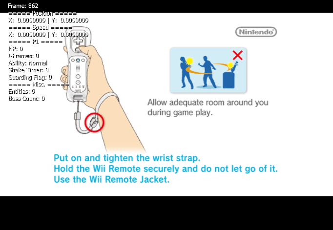

# Getting Started

*You must have [Dolphin Lua Core](https://github.com/MikeXander/Dolphin-Lua-Core.git) to run these scripts.*

**Adding the Script(s)**
1. Retrieve the files from the repo. A simple ```git clone``` should do the trick. Otherwise, select the green Code, then *Download Zip.*

2. Unzip and copy the contents of the folder.

3. Go to the script directory in Lua Core's file system (Sys/Scripts from the root directory).

4. Paste what you copied earlier.

**Running the Scripts**

1. Open Lua Core and load KRTDL. It **must** be KRTDL with Game ID *SUKE01*, or else this will not work (in the future, I will try to make this possible for other regional versions). The game must also be running.

2. Go to the toolbar at the top, and navigate to Tools -> Execute Script.

3. Press the dropdown and select the script that says 'KRTDL_Text.lua.'

4. If your screen looks something like this... 

then you've succeeded!